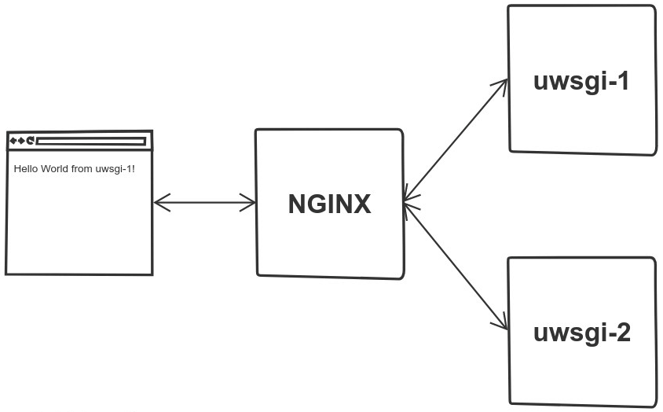

Vamos a desplegar una aplicación web desarrollada en Python con el framework Flask que se ejecuta en dos contenedores 
Docker con el servidor uWSGI. Se utiliza un servidor NGINX, también en un contenedor Docker, como proxy inverso y 
balanceador de carga entre ambos servidores uWSGI.

Este escenario corresponde a la entrada [Despliegue de una aplicación web Python en Docker con NGINX como proxy inverso
y balanceador de carga](https://aprenderdevops.com/despliegue-de-una-aplicacion-web-python-en-docker-con-nginx-como-proxy-inverso-y-balanceador-de-carga/).